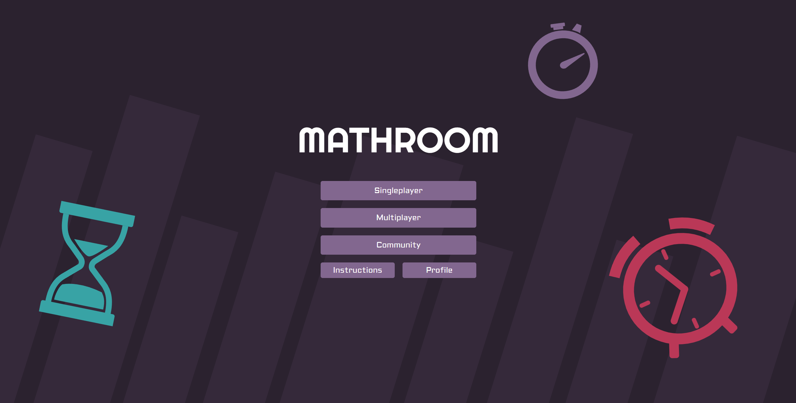
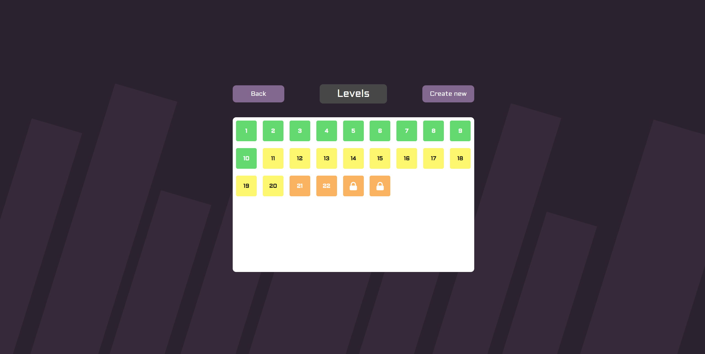
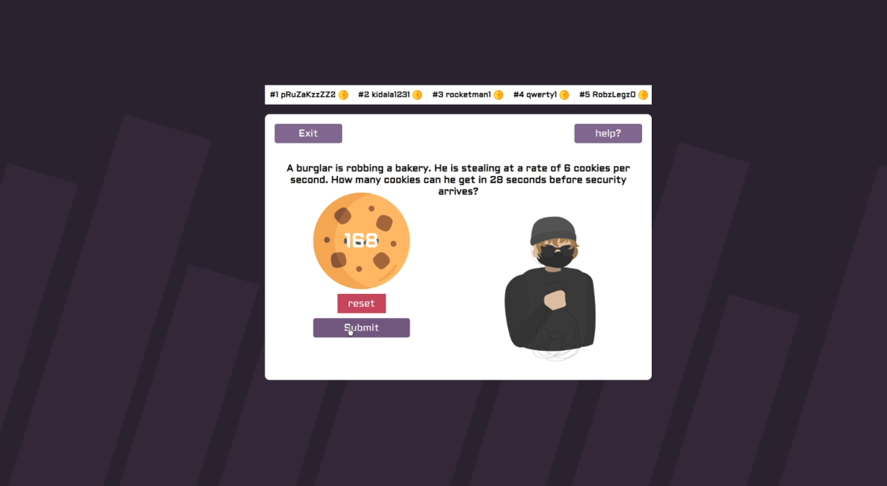
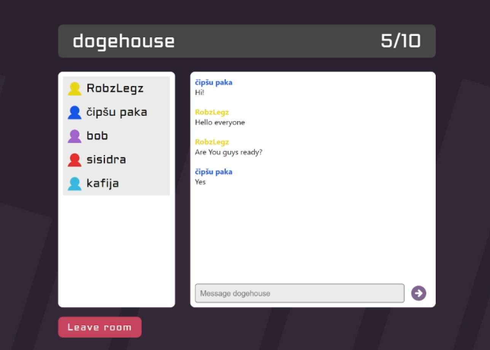
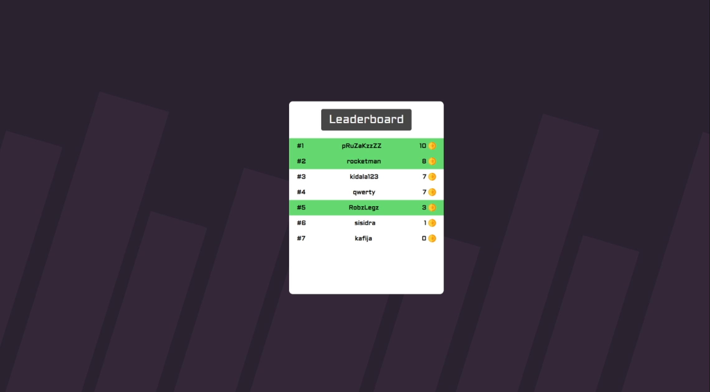
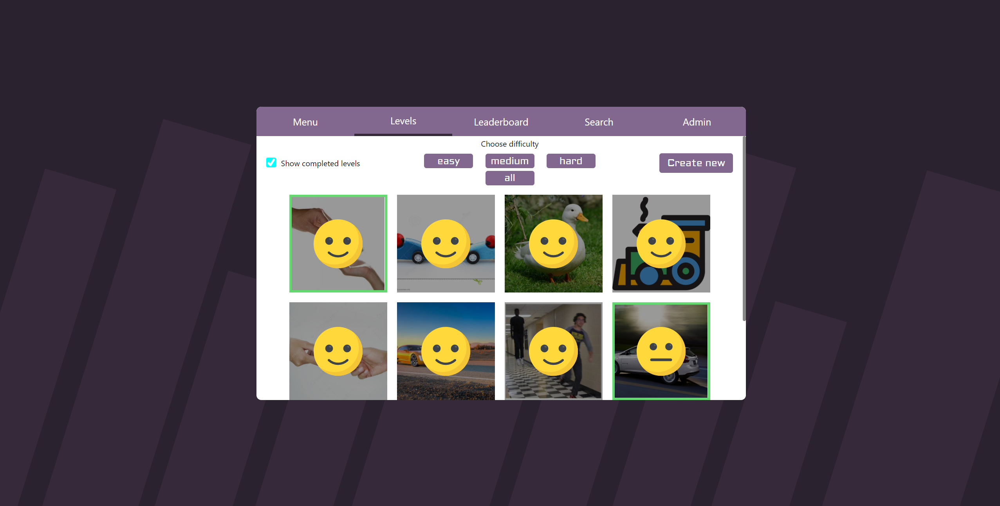
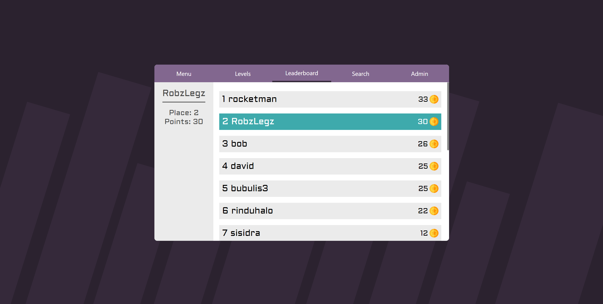

<a href="https://mathroom.vercel.app">
  <p align="center">
    
  </p>
</a>
<p align="center">
  <strong>Learn math while playing games!</strong>
</p>
<p align="center">
  
</p>
<br />
<h2>Trailer</h2>
<p>Scan the QR code or <a href="http://www.youtube.com/watch?v=GiuGMRkt9ak">click here</a> to watch trailer</p>
<a href="http://www.youtube.com/watch?v=GiuGMRkt9ak">
  
</a>
<h2>Contributors:</h2>
<ul>
  <li><a href="https://github.com/RobzLegz">@RobzLegz</a> - Full stack developer, project manager</li>
  <li><a href="https://github.com/Neetrah">@Neetrah</a> - Designer</li>
  <li><a href="https://github.com/Sanvirus">@Sanvirus</a> - Tasks, privacy policy, game logic</li>
</ul>
<h2>Tech stack:</h2>
<table>
  <tr>
    <th>Language</th>
    <th>Typescript</th>
  </tr>
  <tr>
    <th>Frontend</th>
    <th>NextJS</th>
  </tr>
  <tr>
    <th>Database</th>
    <th>MongoDB</th>
  </tr>
  <tr>
    <th>Socket</th>
    <th>Socket.IO</th>
  </tr>
  <tr>
    <th>Stylesheet</th>
    <th>Sass/Scss</th>
  </tr>
  <tr>
    <th>PacMan</th>
    <th>yarn</th>
  </tr>
</table>
<h2>Run locally:</h2>
<ul>
  <li>Download git <a href="https://git-scm.com/downloads">here</a></li>
  <li>Download nodeJS <a href="https://nodejs.org/en/">here</a></li>
  <li>Install yarn by running <code>npm i -g yarn</code> in command line</li>
  <li>Clone project by running <code>git clone https://github.com/RobzLegz/mathroom</code> in command line</li>
  <li>Install dependencies with yarn <code>cd mathroom</code> + <code>yarn install</code></li>
  <li>Run server <code>yarn dev</code></li>
  <li>Clone socket <code>git clone https://github.com/RobzLegz/mathroom-socket socket</code></li>
  <li>Install dependencies with yarn <code>cd socket</code> + <code>yarn install</code></li>
  <li>Run socket server <code>yarn dev</code></li>
</ul>
<h2>Releases</h2>
<table>
  <tr>
    <th>Release</th>
    <th>Description</th>
  </tr>
  <tr>
    <th>v2.0.0</th>
    <th>Multiplayer | Community page</th>
  </tr>
  <tr>
    <th>v1.0.2</th>
    <th>Multiplayer | Bug fixes</th>
  </tr>
  <tr>
    <th>v1.0.1</th>
    <th>Chatroom</th>
  </tr>
  <tr>
    <th>v1.0.0</th>
    <th>Futere plans</th>
  </tr>
</table>
<h2>Algorythm</h2>
<h3>To generate a task the only requirement is task type and based on that a level/task is returned</h3>
  
```tsx
const renderActiveTaskFromType = (type: string, needHelp: boolean, setNeedHelp: any, multiplayer: boolean) => {
    switch(type){
        case "age": return <TypeAge needHelp={needHelp} setNeedHelp={setNeedHelp} multiplayer={multiplayer} />;
        case "time sum": return <TimeSum needHelp={needHelp} setNeedHelp={setNeedHelp} multiplayer={multiplayer} />;
        case "time difference": return <TimeDifference needHelp={needHelp} setNeedHelp={setNeedHelp} multiplayer={multiplayer} />;
        case "time difference minutes": return <TimeDifferenceMinutes needHelp={needHelp} setNeedHelp={setNeedHelp} multiplayer={multiplayer} />;
        case "time difference minutes2": return <TimeDifferenceMinutesSecond needHelp={needHelp} setNeedHelp={setNeedHelp} multiplayer={multiplayer} />;
        case "month amount": return <MonthAmount needHelp={needHelp} setNeedHelp={setNeedHelp} multiplayer={multiplayer} />;
        case "day amount": return <DayAmount needHelp={needHelp} setNeedHelp={setNeedHelp} multiplayer={multiplayer} />;
        case "second amount": return <SecondAmount needHelp={needHelp} setNeedHelp={setNeedHelp} multiplayer={multiplayer} />;
        case "roman numerals": return <RomanNumerals needHelp={needHelp} setNeedHelp={setNeedHelp} multiplayer={multiplayer} />;
        case "kilometers apart": return <KilometersApart needHelp={needHelp} setNeedHelp={setNeedHelp} multiplayer={multiplayer} />;
        case "road calculation": return <RoadCalculation needHelp={needHelp} setNeedHelp={setNeedHelp} multiplayer={multiplayer} />;
        case "road calculation2": return <RoadCalculationSecond needHelp={needHelp} setNeedHelp={setNeedHelp} multiplayer={multiplayer} />;
        case "time calculation": return <TimeCalculation needHelp={needHelp} setNeedHelp={setNeedHelp} multiplayer={multiplayer} />;
        case "m/min to m/h": return <MminToMh needHelp={needHelp} setNeedHelp={setNeedHelp} multiplayer={multiplayer} />;
        case "speed calculation": return <SpeedCalculation needHelp={needHelp} setNeedHelp={setNeedHelp} multiplayer={multiplayer} />;
        case "acceleration calculation": return <AccelerationCalculation needHelp={needHelp} setNeedHelp={setNeedHelp} multiplayer={multiplayer} />;
        case "uniformly slow motion": return <UniformlySlowMotion needHelp={needHelp} setNeedHelp={setNeedHelp} multiplayer={multiplayer} />;
        case "time from acceleration + distance": return <TimeAccelerationDistance needHelp={needHelp} setNeedHelp={setNeedHelp} multiplayer={multiplayer} />;
        case "average speed": return <AverageSpeed needHelp={needHelp} setNeedHelp={setNeedHelp} multiplayer={multiplayer} />;
        case "distance between2": return <DistanceBetween2 needHelp={needHelp} setNeedHelp={setNeedHelp} multiplayer={multiplayer} />;
        case "pool fill": return <PoolFill needHelp={needHelp} setNeedHelp={setNeedHelp} multiplayer={multiplayer} />;
        case "pool spill": return <PoolSpill needHelp={needHelp} setNeedHelp={setNeedHelp} multiplayer={multiplayer} />;
        case "cookies": return <Cookies needHelp={needHelp} setNeedHelp={setNeedHelp} multiplayer={multiplayer} />;
        case "flys": return <Flys needHelp={needHelp} setNeedHelp={setNeedHelp} multiplayer={multiplayer} />
        case "cookie heist": return <CookieHeist needHelp={needHelp} setNeedHelp={setNeedHelp} multiplayer={multiplayer} />
    }

    return null;
}
```

<h3>Algorythm generates a random value when the task/level loads</h3>

```tsx
    const [selectedValue, setSelectedValue] = useState<number>(0);
    const [time] = useState<number>(Math.floor((Math.random() * 4) + 2));
    const [cookies] = useState<number>(Math.floor((Math.random() * 3) + 3));
    const [correctValue] = useState<number>(time * cookies);

    const completeLevel = (e: any) => {
        e.preventDefault();

        if(multiplayer){
            if(selectedValue !== correctValue){
                return completeSocketLevel(false, dispatch);
            }
            return completeSocketLevel(true, dispatch);
        }

        if(selectedValue !== correctValue){
            return dispatch(setNotification({type: "error", message: "Incorrect answer!"}));
        }
    }
```

<h2>Screenshots</h2>








